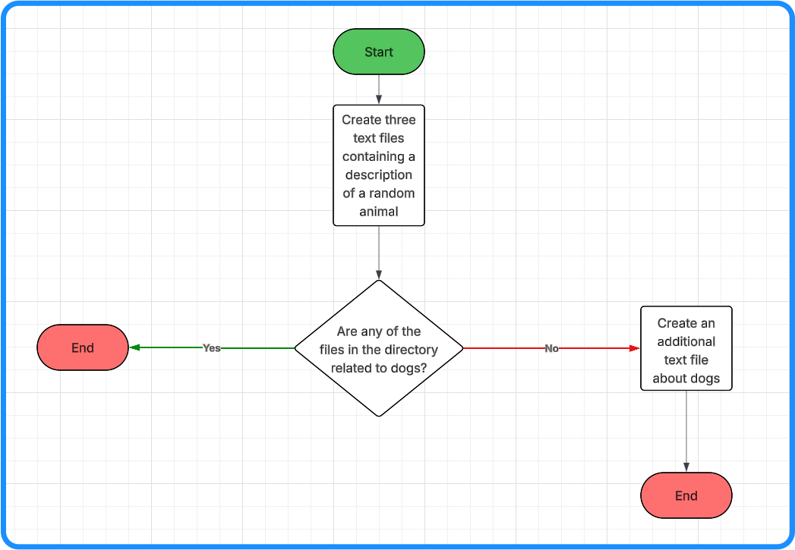

# MonadsCLI
### (Pre-Alpha)

<strong>Run Lucidchart decision trees with agentic CLI's.</strong>

---

Easy prompt running for local or cloud agentic workflows.

Reusable easy-to-read logic flows.

Dockerizable, works with <a href="https://docs.github.com/en/actions">GitHub Actions</a>.

Built-in and customizable <a href="readme/settings.md">validation and retries</a>.

Specify <a href="readme/metadata.md">agents for specific tasks</a> with cross-agent validation.

Built-in support for: <strong>Agent CLI (Cursor)</strong>, <strong>Claude CLI</strong>, <strong>Gemini CLI</strong>, <strong>Qodo CLI</strong>.

---

## Docs

- [Quick](readme/quick.md)
- [Install](readme/install.md)
- [Creating a Lucidchart decision tree](readme/create-tree.md)
- [Metadata in trees](readme/metadata.md)
- [Settings and keys](readme/settings.md)
