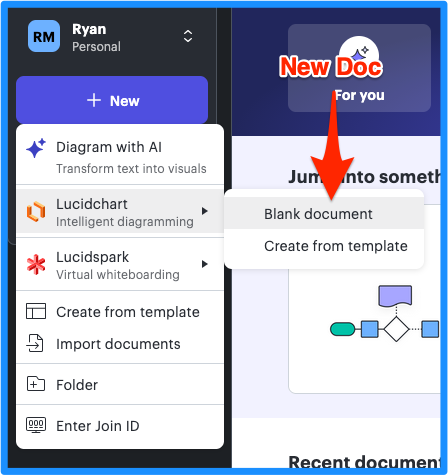
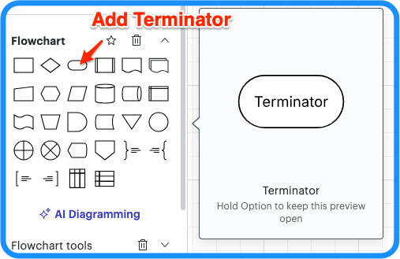
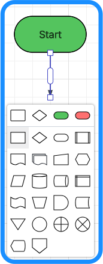
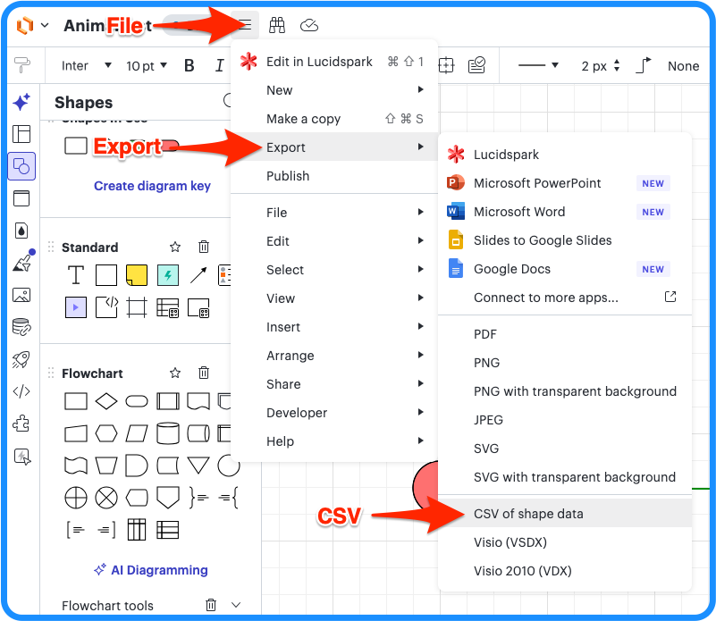
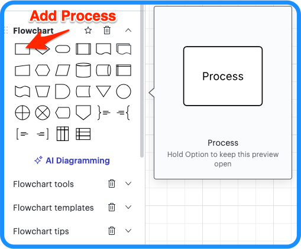
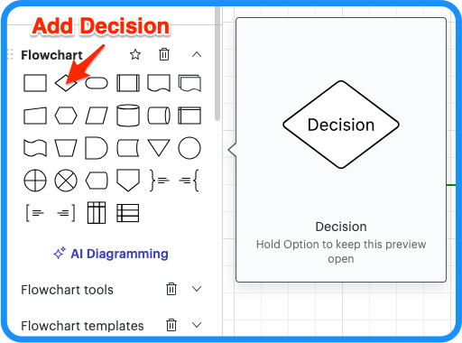

# Creating a Lucidchart Decision Tree

<strong>1. Open Lucidchart</strong> (<a href="https://lucid.app/documents">lucid.app/documents</a>) and create a new flowchart (empty doc).

<strong>2. Create a terminator node</strong> and label it "Start".

<strong>3. Drag the node handles</strong> to add terminators, process nodes, decision nodes, and predefined processes, until the tree is complete.

<strong>4. Export to CSV</strong> to save in project.

---

# Node Types

<strong>Terminator</strong> – A terminator starts or stops the flow. Change the text to "Start" or "End".

<strong>Process</strong> – A process node runs the text from the node with an AI CLI. After the process completes, a second CLI is used to automatically validate the changes made by the process. Unvalidated results will automatically be retried. See <a href="decision-tree-process.md">Decision tree process</a> for the full pipeline (run, validate, retry).

<strong>Decision</strong> – A multiple choice question posed to the LLM to determine which branch to follow. Any node with multiple children with labeled choice arrows will be treated as a decision node.

<strong>Predefined process</strong> – A predefined process runs the same as a regular process but can be used to distinguish prompts that use traditional deterministic tooling like scripts or MCPs.

---

## Docs

- [Quick](quick.md)
- [Install](install.md)
- [Creating a Lucidchart decision tree](create-tree.md)
- [Metadata in trees](metadata.md)
- [Settings and keys](settings.md)

