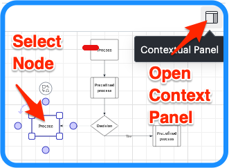
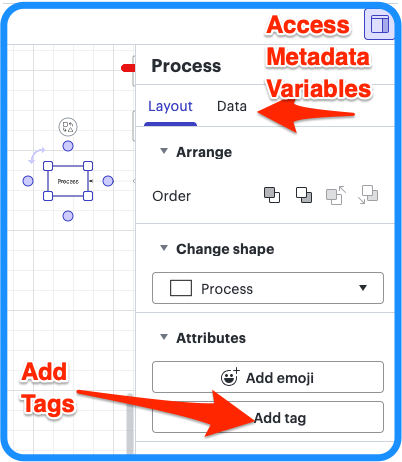
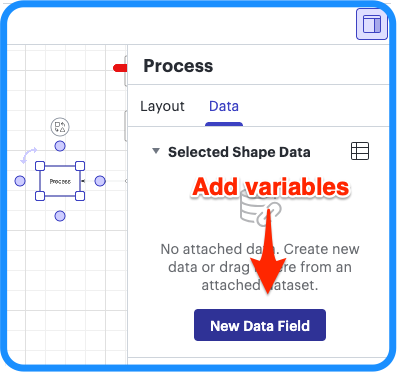
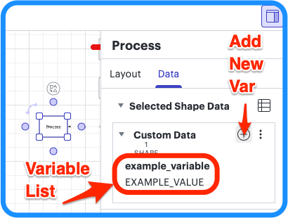

# Node Tags and Metadata Variables

**Tags** and **metadata variables** can be applied to provide custom behvavior to nodes in the decision tree in Lucidchart. The chart stores this configuration, so overrides for options like CLI, validation, retries, and timeouts live directly in the tree.

---

# Adding Tags and Variables in Lucidchart

<strong>1. Open panel</strong> – Select a process node and open the context panel (right side of the canvas).

<strong>2. Add tags</strong> – Click <strong>Add tag</strong> to add a new tag to the node. Click <strong>Data</strong> to access metadata variables.

<strong>3. Add metadata variables if not present</strong> – If no variables exist, click <strong>New data field</strong> to add the first one.

<strong>4. Add or edit metadata variables</strong> – Click to add new variables or edit existing variable names and values.

---

# Tags vs. Metadata Variables

| | **Tags** | **Metadata variables** |
|---|----------|-------------------------|
| **What they are** | Short labels on the node (e.g. `NoValidation`, `GEMINI`). | Key/value pairs in the node's **Data** section (e.g. `validate_prompt` = `Did the model follow the instructions?`). |
| **Where to set them** | In the **Tags** section of the node's context panel, with a process node selected. | In the **Data** section of the node's context panel, with a process node selected. |
| **Differences** | Visible from chart with color codes. No data values. | Visible only from data context panel. Allows custom data values. |

---

# Tags

| Tag | Effect |
|-----|--------|
| **NoValidation** | Validation is skipped for this node. Use for steps that don’t need a check. Accepts NoValidation, novalidation, no_validation, noValidation. |
| **&lt;CLI codename&gt;** | Use that CLI to run this node instead of the default. Any tag matching a known CLI codename (`GEMINI`, `CURSOR`, `CLAUDE`, `COPILOT`, `AIDER`, `QODO`) sets the node’s CLI. Case-insensitive (e.g. gemini, GEMINI) |

---

# Metadata Variables

| Variable | Effect | Example value |
|----------|--------|---------------|
| **validate_cli** | Which CLI validates this node’s response | `GEMINI`, `CURSOR`, `CLAUDE`, `COPILOT`, `AIDER`, `QODO` |
| **retry_cli** | Which CLI retries after validation failure | `GEMINI`, `CURSOR`, `CLAUDE`, `COPILOT`, `AIDER`, `QODO` |
| **retries** | Maximum retries when validation fails | `3`, `5` |
| **timeout** | Timeout in seconds for CLI operations (0 = use runner default) | `600`, `300` |
| **validate_prompt** | Custom validation prompt text; ignored if node has **NoValidation** tag | `Did the model follow the instructions exactly?` |

---

## Docs

- [Quick](quick.md)
- [Install](install.md)
- [Creating a Lucidchart decision tree](create-tree.md)
- [Metadata in trees](metadata.md)
- [Settings and keys](settings.md)

